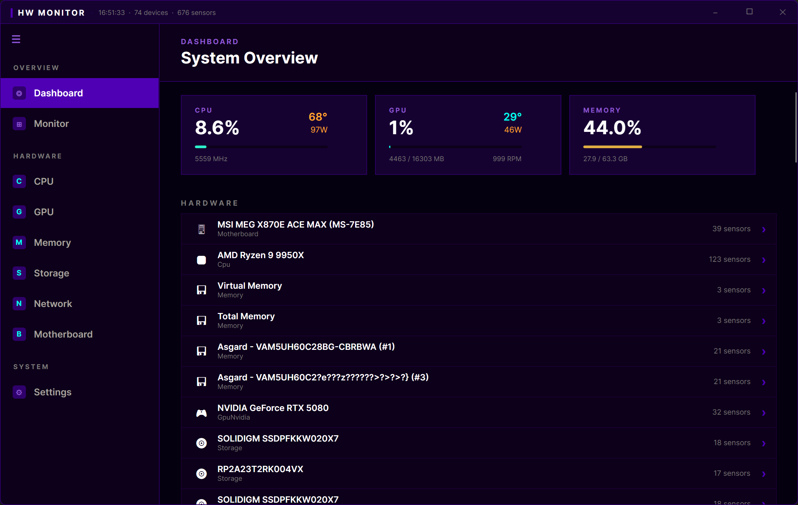
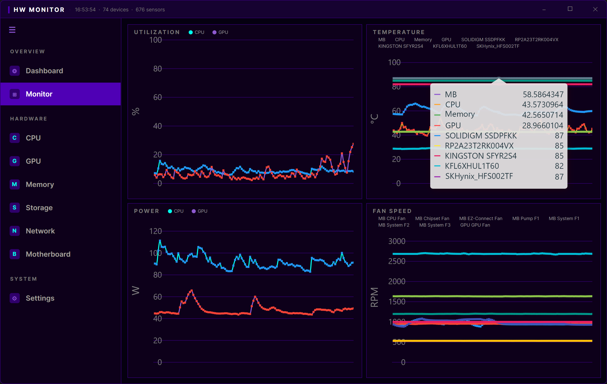
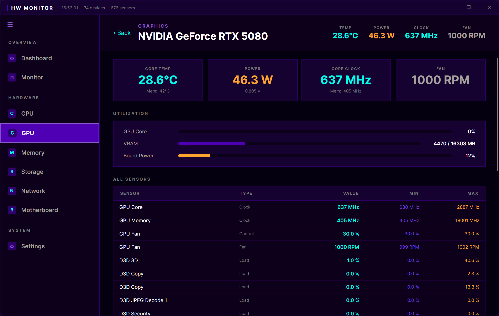

# HW Monitor

A modern, cross-platform hardware monitoring application built with [Avalonia UI](https://avaloniaui.net/) and [LibreHardwareMonitor](https://github.com/LibreHardwareMonitor/LibreHardwareMonitor).



## Features

- **Dashboard** — At-a-glance system overview with CPU, GPU, and memory summary cards, plus a full hardware device list
- **Real-time Monitor** — Live charts for utilization, temperature, power, and fan speed history
- **Hardware Details** — Dedicated detail views for CPU, GPU, Memory, Storage, Network, and Motherboard with all available sensors
- **System Tray** — Minimize to tray for background monitoring
- **Auto Start** — Optional launch on system startup





## Supported Platforms

| Platform | Architecture |
|----------|-------------|
| Windows  | x64, ARM64  |
| macOS    | ARM64       |
| Linux    | x64, ARM64  |

## Tech Stack

- **.NET 10** — Target framework
- **Avalonia UI 11** — Cross-platform XAML UI framework
- **LibreHardwareMonitor** — Hardware sensor library (git submodule)
- **CommunityToolkit.Mvvm** — MVVM framework with source generators
- **LiveCharts2** — Real-time charting (SkiaSharp backend)
- **NativeAOT** — Optional ahead-of-time compilation for smaller, faster binaries

## Building

### Prerequisites

- [.NET 10 SDK](https://dotnet.microsoft.com/download/dotnet/10.0)

### Clone

```bash
git clone --recursive https://github.com/MadLongTom/HardwareMonitor.git
cd HardwareMonitor
```

### Build & Run

```bash
dotnet run -c Release -r win-x64      # Windows x64
dotnet run -c Release -r osx-arm64    # macOS Apple Silicon
dotnet run -c Release -r linux-x64    # Linux x64
```

### Publish

```bash
# NativeAOT (smallest, fastest startup)
dotnet publish -c Release -r win-x64 -p:PublishAot=true

# Self-contained single file
dotnet publish -c Release -r win-x64 --self-contained -p:PublishSingleFile=true

# Framework-dependent (requires .NET 10 runtime)
dotnet publish -c Release -r win-x64 --no-self-contained -p:PublishSingleFile=true
```

## Downloads

Pre-built binaries are available on the [Releases](https://github.com/MadLongTom/HardwareMonitor/releases) page. Each release includes:

- **NativeAOT Portable** — Standalone AOT-compiled binary, no runtime needed
- **Runtime Portable** — Self-contained single-file with .NET runtime bundled
- **Runtime Setup** — Installer (Windows `.exe` / Linux `.deb` / macOS `.dmg`) with bundled runtime
- **Portable Setup** — Installer that requires .NET 10 runtime pre-installed

## License

This project uses [LibreHardwareMonitor](https://github.com/LibreHardwareMonitor/LibreHardwareMonitor) which is licensed under [MPL-2.0](https://github.com/LibreHardwareMonitor/LibreHardwareMonitor/blob/master/Licenses/LICENSE).
